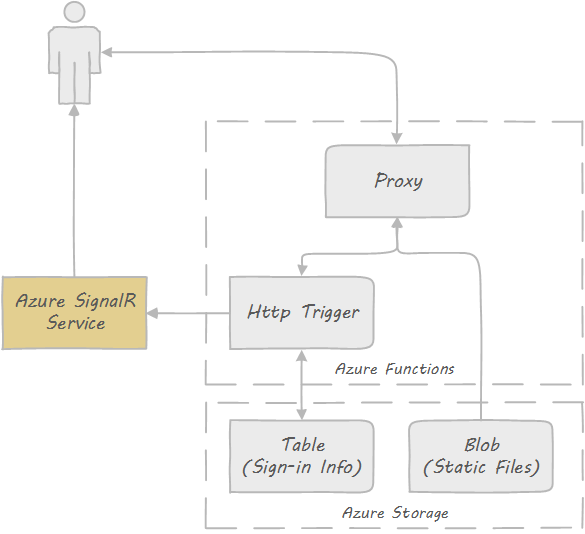

# Realtime Sign-in Example using Azure SignalR Service

[Not working after latest SignalR update, still working on a fix]

This sample application shows how to build a realtime application using Azure SignalR Service and serverless architecture. When you open homepage of the application, you will see how many people has visited this page (and their OS and browser distribution) and the page will auto update when others open the same page.

## How Does It Work

The application is built on top of Azure SignalR Service, Functions and Storage. There is no web server needed in this sample.

Here is a diagram that illustrates the structure of this appliaction:

1. When user opens the homepage, a HTTP call will be made to an API exposed by Azure Function HTTP trigger, which will record your information and save it to Azure table storage.
2. This API also returns a url and token for browser to connect to Azure SignalR Service.
3. Then the API calculate statistics information (number of visits, OS and browser distribution) and use Azure SignalR Service to broadcast to all clients so browser can do a realtime update without need to do a refresh.
4. The static content (homepage, scripts) are stored in Azure blob storage and exposed to user through Azure Function proxy.

## How to Deploy to Azure

TO BE ADDED
