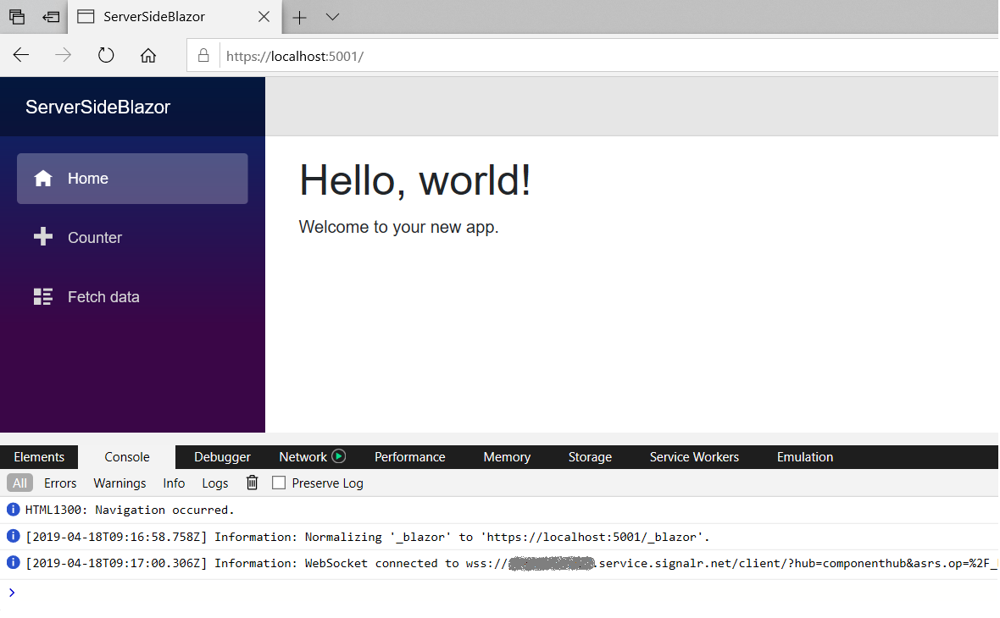

# Server-side Blazor with Azure SignalR Service

This sample is to show how to make Server-side Blazor work with Azure SignalR Service.

## Prerequisites
* Install .NET Core 3.0 SDK (Version >= 3.0.100-preview4-011136)
* Provision an Azure SignalR Service instance

Set the connection string in the [Secret Manager](https://docs.microsoft.com/en-us/aspnet/core/security/app-secrets?view=aspnetcore-2.1&tabs=visual-studio#secret-manager) tool for .NET Core, and run this app.

```
dotnet restore
dotnet user-secrets set Azure:SignalR:ConnectionString "<your connection string>"
dotnet run
```

After running, you will see that the web server starts, makes connections to the Azure SignalR Service instance and creates an endpoint at `http://localhost:5001/`. Browser the page and click F12, you can find the connection to Azure SignalR Service is created. See snapshot 



## Steps one by one
1. Create Blazor-server side project.

```
dotnet new blazorserverside 
```

2. Add reference to Azure SignalR SDK
```
dotnet add package Microsoft.Azure.SignalR --version 1.1.0-preview1-10382 --source https://www.myget.org/F/azure-signalr-dev/api/v3/index.json
```

3. Add configuration to use Azure SignalR Service in `appsetting.json`
```
  "Azure": {
    "SignalR": {
      "Enabled": true,
      "ConnectionString": ""
    }
  }
```

4. Assign hosted startup assembly to use Azure SignalR. Edit `launchSettings.json` in Properties folder and add a configuration like below inside `environmentVariables`.
```
"ASPNETCORE_HOSTINGSTARTUPASSEMBLIES": "Microsoft.Azure.SignalR"
```

5. Configure Azure SignalR Service `ConnectionString` either in appsettings.json or use [Secret Manager](https://docs.microsoft.com/en-us/aspnet/core/security/app-secrets?view=aspnetcore-2.1&tabs=visual-studio#secret-manager) tool.

> Notes: Step 3 and 4 can be replaced by directly calling AddAzureSignalR(), update `ConfigureServices()` in `StartUp.cs` like below.
> 
> ```
> services.AddServerSideBlazor().AddSignalR().AddAzureSignalR();
> ```

