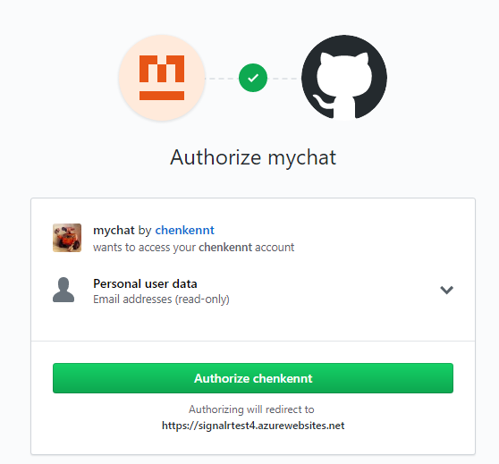

# Implement Your Own Authentication

The authentication in previous tutorial is actually very simple, you claim who you are and authentication API will give you a token with that name.
This is not really useful in real applications, in this tutorial you'll learn how to implement your own authentication and integrate with SignalR service.

GitHub provides OAuth APIs for third-party applications to authenticate with GitHub accounts. Let's use these APIs to allow users to login to our chat room with GitHub ID.

## Create an OAuth App

First step is to create a OAuth App in GitHub:

1. Go to GitHub -> Settings -> Developer Settings, and click "New OAuth App".
2. Fill in application name, description and homepage URL.
3. Authorization callback URL is the url GitHub will redirect you to after authentication. For now make it `http://localhost:5000/api/auth/callback`.
4. Click "Register application" and you'll get an application with client ID and secret, you'll need them later when you implement the OAuth flow.

## Implement OAuth Flow

The first step of OAuth flow is to ask user to login with GitHub account. This can be done by redirect user to the GitHub login page.

Add a link in the chat room for user to login:

```js
appendMessage('_BROADCAST_', 'You\'re not logged in. Click <a href="/api/auth/login">here</a> to login with GitHub.');
```

The link points to `/api/auth/login` which redirects to GitHub with client ID of the application:

```cs
[HttpGet("login")]
public IActionResult Login()
{
    return Redirect($"https://github.com/login/oauth/authorize?scope=user:email&client_id={_clientId}");
}
```

GitHub will check whether you have already logged in and authorized the application, if not it will ask you to login and show a dialog to let you authorize the application:



After you authorized the application, GitHub will return a code to the application by redirecting to the callback url of the application.

The code can be used to get the actual access token of the account:

```cs
private async Task<string> GetToken(string code)
{
    var body = JsonConvert.SerializeObject(new Dictionary<string, string> {
        { "client_id", _clientId },
        { "client_secret", _clientSecret },
        { "code", code },
        { "accept", "json" }
    });
    var response = await _httpClient.PostAsync("https://github.com/login/oauth/access_token", new StringContent(body, Encoding.UTF8, "application/json"));
    var tokenString = await response.Content.ReadAsStringAsync();
    var tokenObject = JsonConvert.DeserializeObject<Dictionary<string, string>>(tokenString);
    return tokenObject["access_token"];
}
```

With the access token, you can call GitHub to get user information like name and company:

```cs
private async Task<UserInfo> GetUser(string token)
{
    var userString = await _httpClient.GetStringAsync($"https://api.github.com/user?access_token={token}");
    var userObject = JsonConvert.DeserializeObject<Dictionary<string, string>>(userString);
    return new UserInfo
    {
        Name = userObject["login"],
        Company = userObject["company"]
    };
}
```

Then add an API to handle the callback from GitHub:

```cs
[HttpGet("callback")]
public async Task<IActionResult> Callback(string code)
{
    var hubName = "chat";
    var githubToken = await GetToken(code);
    var user = await GetUser(githubToken);
    var serviceUrl = _endpointProvider.GetClientEndpoint(hubName);
    var accessToken = _tokenProvider.GenerateClientAccessToken(hubName, new[]
    {
        new Claim(ClaimTypes.NameIdentifier, user.Name),
        new Claim("Company", user.Company ?? "")
    });
    Response.Cookies.Append("githubchat_access_token", accessToken);
    Response.Cookies.Append("githubchat_service_url", serviceUrl);
    Response.Cookies.Append("githubchat_username", user.Name);
    return Redirect("/");
}
```

The API does the following:

1. Get access token from the code.
2. Get username and company from access token.
3. Generate a SignalR access token with these claims.
4. Return access token and service url in cookies and redirect back to the chat room page.

> For more details about GitHub OAuth flow, please refer to this [article](https://developer.github.com/v3/guides/basics-of-authentication/).

> The full sample code can be found [here](../samples/GitHubChat/).

## Update Hub Code

Then let's update the hub to use user's claim.

In previous tutorial `broadcastMessage()` method takes a `name` parameter to let caller claim who he is, which is apparently not secure.
Let's remove the `name` parameter and read username from the authenticated user's claim:

```cs
public void broadcastMessage(string message)
{
    var username = Context.Connection.User.Claims.First(c => c.Type == ClaimTypes.NameIdentifier).Value;
    Clients.All.SendAsync("broadcastMessage", username, message);
}
```

## Update Client Code

Finally let's update client code to use the new authentication API:

```js
var accessToken = getCookie('githubchat_access_token'), serviceUrl = getCookie('githubchat_service_url'), username = getCookie('githubchat_username');
if (!accessToken) {
    appendMessage('_BROADCAST_', 'You\'re not logged in. Click <a href="/api/auth/login">here</a> to login with GitHub.');
} else {
    startConnection(serviceUrl, bindConnectionMessage)
        .then(onConnected)
        .catch(() => appendMessage('_BROADCAST_', 'You\'re not logged in. Click <a href="/api/auth/login">here</a> to login with GitHub.'));
}
```

Instead of calling the auth API to get access token, we try to get it from cookies.
If it doesn't exist, display a message to ask user to login.

Also the token may expire after some time, so display the same login message if connection failure happens.

Now you can run the project to chat using your GitHub ID:

```
export AzureSignalRConnectionString=<connection_string>
export GitHubClientId=<client_id>
export GitHubClientSecret=<client_secret>
dotnet build
dotnet run
```

## Deploy to Azure

Deploy to Azure is same as before, just you need to set two new settings we just added:

```
az webapp config appsettings set --resource-group <resource_group_name> --name <app_name> \
   --setting GitHubClientId=<client_id>
az webapp config appsettings set --resource-group <resource_group_name> --name <app_name> \
   --setting GitHubClientSecret=<client_secret>
```

And change the callback url of your GitHub app from localhost to the actual Azure website.

## Customize Hub Method Authorization

It is possible to define different permission level on hub methods.
For example, we don't want everyone to be able to send message in chat room.
To achieve this we can define a custom authorization policy:

```cs
services.AddAuthorization(options =>
{
    options.AddPolicy("Microsoft_Only", policy => policy.RequireClaim("Company", "Microsoft"));
});
```

This policy requires user to have a "Microsoft" company claim.

Then apply the policy to `broadcastMessage()` method:

```cs
[Authorize(Policy = "Microsoft_Only")]
public void broadcastMessage(string message)
{
    ...
}
```

Now if your GitHub account's company is not Microsoft, you cannot send message in the chat room. But you can still see others' messages.

> If you use `send()` to call hub, SignalR won't send back a completion message so you won't know whether the call is succeeded or not.
> So if you want to get a confirmation of the hub invocation (for example in this case you want to know whether your call has enough permission) you need to use `invoke()`:
>
> ```js
> connection
>     .invoke('broadcastMessage', messageInput.value)
>     .catch(e => appendMessage('_BROADCAST_', e.message));
> ```
